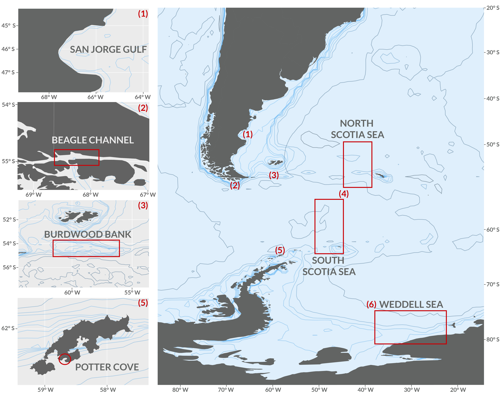
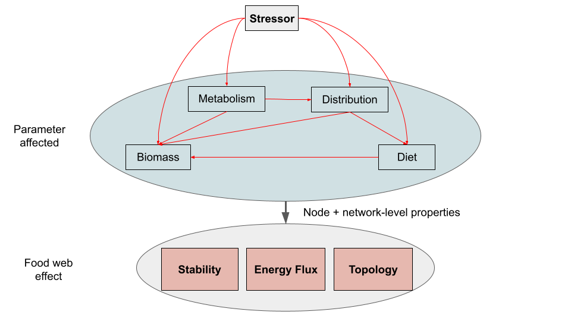

# The response of trophic interaction networks to multiple stressors in a marine latitudinal gradient of the Southern Hemisphere

 Tomás I. Marina^1^, Leonardo A. Saravia^1,2^, Fernando Momo ^3,4^

 ^1^ Centro Austral de Investigaciones Científicas (CADIC-CONICET), Ushuaia, Argentina;
 ^2^ Instituto de Ciencias Polares, Ambiente y Recursos Naturales, Universidad Nacional de Tierra del Fuego, Argentina;
 ^3^ Departamento de Ciencias Básicas, Universidad Nacional de Luján, Argentina;
 ^4^ Instituto de Ecología y Desarrollo Sustentable (UNLu -- CONICET)
  

 Corresponding author:

 Dr. Leonardo A. Saravia  <lasaravia@untdf.edu.ar>, Dr. Tomás I. Marina <tomasimarina@gmail.com>

 Centro Austral de Investigaciones Científicas (CADIC-CONICET), Bernardo Houssay 200 (9410) Ushuaia, Argentina
 

 **Author contributions**: TIM and LAS originally formulated the idea, TIM, LAS, FM
 developed the methodology, TIM, LAS, FM analyzed the data and wrote the manuscript.

## Abstract

1. Ecological networks are increasingly used as conceptual frameworks for understanding ecological community structure, identifying key species, and for ecosystem management and biodiversity conservation.

2. Here we propose to review the response of trophic interaction networks, hereafter food webs, to multiple stressors in six marine ecosystems along a latitudinal gradient in the Southern Hemisphere: San Jorge Gulf (45-47°S, 65-68°W), Beagle Channel (54°S, 68°W), Burdwood Bank (54°S, 59°W), Scotia Sea (57°S, 50°W), Potter Cove (62°S, 58°W, Antarctica), and Weddell Sea (74-78°S, 30°W, Antarctica). The food webs for the chosen systems are highly resolved, meaning that the overwhelming majority of nodes are resolved to genus or species level. These locations include temperate to Antarctic ecosystems exposed to both anthropogenic (fisheries, pollution) and environmental (temperature increase) impacts.

3. Our primary objectives are to: 1) describe and compare the food webs in terms of network properties of complexity, structure, potential stability; 2) show how these properties could be impacted due to the ongoing anthropogenic and/or environmental stressors; 3) identify key species and its characteristics (i.e. trophic position) for the stability of the food web; and 4) give suggestions on which data and analyses are needed to gain insights into ecosystem functioning and perturbation response.

4. This review will show the advantages of applying a network approach to better understand marine ecosystems of the Southern Hemisphere. Overall, this paper will make progress towards gaining a comprehensive knowledge to predict the responses of complex marine systems to anthropogenic and environmental changes.

## Introduction

Ecological networks are increasingly used as conceptual frameworks for understanding ecological community structure, identifying key species, and for ecosystem management and biodiversity conservation [@Thompson2012]. Recently, there has been an upsurge in interest regarding how communities might respond to environmental and anthropogenic changes, applying a network approach [@Montoya2009; @Tylianakis2017]. This is particularly crucial in marine ecosystems where changes are of unprecedented magnitudes [@Gutt2015; @Turner2020; @Galvan2022].
In this review, we focus on the actual and potential changes in prey-predator networks, hereafter food webs, driven by reported stressors in selected marine ecosystems along a latitudinal gradient in the Southern Hemisphere (45 - 78ºS). We only considered those cases where highly-resolved food webs, describing the ecosystem’s diversity of species and trophic interactions, were published. Then, we included the following ecosystems: San Jorge Gulf (45 - 47ºS, 65-68ºW), Beagle Channel (~54ºS, 68ºW), Burdwood Bank (~54ºS, 59ºW), Scotia Sea (48 - 58ºS, 50ºW), Potter Cove (62ºS, 58ºW, Antarctica), and Weddell Sea (74 - 78ºS, 30ºW, Antarctica). These locations include temperate to Antarctic ecosystems exposed to both environmental (sea warming, glacial retreat) and anthropogenic (fishery, pollution) stressors.
The aim of this review is threefold: 1) describe the complexity and structure of the above-mentioned marine food webs from a network perspective; 2) identify the ongoing environmental and anthropogenic stressors for each marine ecosystem containing the food webs; and 3) elaborate hypotheses on how the identified stressors might affect food web features (e.g. energy flow, stability), combining information on node- and network-level properties. Finally, we give suggestions on which data and analyses are needed to gain insights into the stressors’ effects on food web properties in the southwest Atlantic - Antarctic region.

## The structure of marine food webs in the Southwest Atlantic - Antarctic region

Together the southwest and the Atlantic sector of the Southern Ocean comprise one of the most biologically productive regions of the world ocean [@Acha2004; @Whitehouse2008; @Ballerini2014; @Latorre2023]. The referred region extends from San Jorge Gulf (45ºS) in the Patagonian shelf to the Weddell Sea (78ºS) in the Southern Ocean, and covers a well-connected oceanic latitudinal gradient [@Matano2010; @Steele2010].
Throughout this latitudinal gradient, many investigations have been carried out addressing the trophic ecology of focal species or particular prey-predator relationships of interest [@Vinuesa2007; @Sailley2013; @Pasotti2015; @Riccialdelli2017; @Riccialdelli2020; @Saunders2019]. In this context, few works have considered the complexity of the ecosystem in terms of species and prey-predator interactions [@Jacob2011; @Marina2018; @Funes2022; @Lopez-Lopez2022; @Rodriguez2022; @Marina2023]. Neglecting this complexity might lead to a misunderstanding of the structure and functioning of the food web, and ultimately reduce the ability to predict ecosystem responses to perturbations [@Montoya2009; @Woodward2010].
In the last decades, the application of a network perspective has emerged as a powerful tool to tackle the complexity of ecosystems facilitating a better understanding of the structure and functioning of empirical marine food webs [@Belgrano2005; @Thompson2012; @DAlelio2016]. Few studies of this type cover a latitudinal gradient in marine ecosystems, with some cases for  the Global North [@Kortsch2019; @Frelat2022; @Pecuchet2022], but none for the Global South or Southern Hemisphere. In this section, we review for the first time the state-of-the-art structure of complex marine food webs in a Southwest Atlantic - Antarctic latitudinal gradient, considering the following marine ecosystems: San Jorge Gulf (45 - 47ºS), Burdwood Bank (~ 54ºS), Beagle Channel (54ºS), Scotia Sea (48 - 58ºS), Potter Cove (62ºS, Antarctica) and Weddell Sea (74 - 78ºS, Antarctica) (Figure 1).

{width="6.27in"
height="3.528in"}

### San Jorge Gulf

### Burdwood Bank

### Beagle Channel

### Potter Cove (Antarctica)

### Scotia Sea

### Weddell Sea (Antarctica)

Located between 74 and 78ºS, the high Antarctic Weddell Sea shelf spans approximately 450 km from East to West [@Jacob2011]. The water depth in this area ranges from 200 to 500 meters, with shallower regions being covered by continental ice that forms the coastline along the eastern and southern parts of the Weddell Sea. Within this shelf area, there exists a complex three-dimensional benthic habitat characterized by substantial benthic biomasses and an intermediate to high diversity when compared to benthic boreal communities [@Dayton1990; @Teixido2002]. The Weddell Sea food web exhibits a high level of network complexity, featuring the greatest number of trophic species and predator-prey interactions among the analyzed food webs. Its connectivity and other topological metrics are intermediate, as shown in Table 1. Recently, the interaction strengths of this food web were estimated, revealing the presence of numerous weak and few strong interactions, which is consistent with findings in other complex food webs. Notably, this asymmetric distribution of interaction strength is likely to promote community persistence. Furthermore, there is evidence suggesting that species with more food web linkages (i.e., higher degree) tend to have higher interaction strength, thus reinforcing their central role [@Marina2023]

\footnotesize

--------------------- ----------- ----------- ----------------- ----------------- ------------- -------------- -------------------------------
**Food web**           **Nodes**   **Links**   **Connectance**   **Path length**   **mean TL**   **Omnivory**   **Reference**
--------------------- ----------- ----------- ----------------- ----------------- ------------- -------------- -------------------------------
San Jorge Gulf        165         1015        0.04              2.17              3.02          0.63           @Funes2022

Beagle Channel        145         1115        0.05              2.12              2.37          0.55           @Rodriguez2022

Burdwood Bank         379         1788        0.01              2.99              2.52          0.49           @Marinainrev

Potter Cove           110         649         0.05              2.33              2.22          0.46           @Marina2018; @Rodriguez2022

N Scotia Sea          218         10008       0.21              1.87              3.29          0.73           @Lopez-Lopez2022

S Scotia Sea          192         7241        0.20              1.90              3.21          0.71           @Lopez-Lopez2022

Weddell Sea           490         16041       0.07              2.19              2.62          0.51           @Jacob2011
----------------------------------------------------------------------------------------------------------------------------------------------

Table: Complexity and structure of the marine food webs considered in the present review. mean TL: mean trophic level.

\normalsize

## Environmental and anthropogenic stressors in the Southwest Atlantic - Antarctic region
  
A stressor is any natural or anthropogenic variable that causes a quantifiable change, irrespective of its direction (increase or decrease), in a biological response [@Cote2016; @Orr2020]. In the light of this, the southwest Atlantic - Antarctic marine biota has been and is subjected to a variety of stressors (e.g. sea warming, glacial retreat, ice changes, acidification, species invasion, fishery, and contaminants). Although it is known that in these ecosystems more than one stressor acts at a given time (e.g. warming and fishery; acidification and contaminants) [@Gutt2015; @Gutt2021], to date stressor assessments have been performed individually. Moreover, the potential for interactive (synergy or antagonism) and additive effects of two or more stressors [@Crain2008; @Cote2016] are almost unknown for the region [@Rowlands2021].
In the following subsections, we describe the reported environmental and anthropogenic stressors, and the species and parameters affected for the marine ecosystems that contain the food webs considered in this review. To summarize this information, we considered: type of stressor, species and parameter affected, and locality (Table 2).

\newpage
\blandscape
\scriptsize

**Study area**                  **Stressor**                                             **Species affected**                                                                                                                                                                                                          **Parameter affected**      **Locality**                                                  **Reference**
------------------------------- -------------------------------------------------------- ----------------------------------------------------------------------------------------------------------------------------------------------------------------------------------------------------------------------------- --------------------------- ------------------------------------------------------------- ------------------------------------------------------------------------------
**San Jorge Gulf**                                                                                                                                                                                                                                                                                                                                                                                               
                                Sea warming                                              Fish assemblage & its prey                                                                                                                                                                                                    Distribution                In situ                                                       @Galvan2022
                                Fishery                                                  Demersal fish community                                                                                                                                                                                                       Biomass                     In situ                                                       @Galvan2022
                                Fishery                                                  Macroinvertebrates, fishes and seabirds                                                                                                                                                                                       Diet                        In situ                                                       @Gonzalez-Zevallos2006; @Gonzalez-Zevallos2011; @Yorio2017
                                Alien species                                            Fish assemblage & its prey                                                                                                                                                                                                    Distribution                In situ                                                       @Galvan2022; @Ciancio2010
                                Urban & industrial pollution                             Seabirds & benthic assemblage                                                                                                                                                                                                 Biomass                     Elsewhere                                                     @Moore1974; @Buskey2016
**Beagle Channel**                                                                                                                                                                                                                                                                                                                                                                                               
                                Urban & industrial pollution                             Macroalgae; Mytilus edulis chilensis, Patagonotothen tessellata                                                                                                                                                               Metabolism                  In situ                                                       @Giarratano2010; @Ferreira2021; @Kaminskyinprep
                                Mercury                                                  Phytoplankton, Zooplankton, *Grimothea gregaria*                                                                                                                                                                              Metabolism                  In situ                                                       @Fioramonti2022
                                Microplastics                                            Mytilus edulis chilensis, Nacella magellanica                                                                                                                                                                                 Metabolism                  In situ                                                       @Perez2020; @Ojeda2021
                                Alien species: Chinook salmon Oncorhynchus tshawytscha   Patagonotothen tessellata, Sprattus fuegensis                                                                                                                                                                                 Diet/Biomass                In situ (the presence), Elsewhere (changes in prey biomass)   @Fernandez2010; @Ciancio2008
**Burdwood Bank**                                                                                                                                                                                                                                                                                                                                                                                                
                                Mercury                                                  Dissostichus eleginoides, Sprattus fuegensis, Patagonotothen ramsayi, Cottoperca trigloides (fishes) & squids                                                                                                                 Metabolism                  In situ                                                       @Fioramonti2022
                                Microplastics                                            Henricia obesa & Odontaster penicillatus (sea stars); Patagonotothen guntheri & P. ramsayi (fishes)                                                                                                                           Metabolism                  In situ                                                       @Cossi2021; @Perez2021
                                Fishery                                                  Target: Dissostichus eleginoides. Bycatch: Macrourus sp., Coelorinchus sp. (fishes), Daption capense, Thalassarche melanophris, Macronectes giganteus, T. chrysostoma, Diomedea epomophora (seabirds), 30+ spp macrobenthos   Biomass                     Elsewhere                                                     @Gaitan2016; @Martinez2022; @APN2022; @Tamini2023
                                Fishery                                                  Thalassarche melanophris, Macronectes giganteus, Daption capense, Diomedea epomophora, M. halli, Procellaria aequinoctialis (seabirds)                                                                                        Diet                        Elsewhere                                                     @Tamini2023
**Scotia Sea, North & South**                                                                                                                                                                                                                                                                                                                                                                                    
                                Mercury                                                  Krefftichthys anderssoni, Protomyctophum bolini, Electrona antarctica, Gymnoscopelus nicholsi, Gymnoscopelus braueri, Dissostichus eleginoides                                                                                Metabolism                  In situ                                                       @Seco2021
                                Ocean acidification + plastics                           Euphausia superba, Limacina retroversa (Pteropoda)                                                                                                                                                                            Metabolism                  In situ                                                       @Rowlands2021; @Manno2022
                                Sea warming                                              Euphausia superba                                                                                                                                                                                                             Metabolism                  In situ                                                       @Murphy2007; @Perry2020
                                Sea warming                                              Euphausia superba                                                                                                                                                                                                             Distribution                In situ                                                       @Atkinson2019
                                Fishery                                                  Euphausia superba                                                                                                                                                                                                             Biomass                     In situ                                                       @Trathan2021
**Potter Cove (Antarctica)**                                                                                                                                                                                                                                                                                                                                                                                     
                                Sediment in water column                                 Microphytobenthos, macroalgae, benthic filter feeders (ascidians), pelagic filter feeders (krill, salps)                                                                                                                      Metabolism                  In situ                                                       @Sahade2015; @Deregibus2016; @Fuentes2016; @Hoffmann2019
                                Sea ice extent                                           Krill                                                                                                                                                                                                                         Biomass                     Elsewhere                                                     @Flores2012
                                Sea ice extent                                           Benthic community (macroalgae, invertebrates)                                                                                                                                                                                 Metabolism                  Elsewhere                                                     @Clark2013; @Campana2018
                                Glacial retreat                                          Benthic community (macroalgae, invertebrates)                                                                                                                                                                                 Biomass                     In situ                                                       @Quartino2013; @Lagger2017; @Lagger2018
                                Iceberg scouring                                         Benthic community                                                                                                                                                                                                             Biomass                     In situ                                                       @Deregibus2017; @Deregibus2023
                                Sea warming                                              Phytoplankton                                                                                                                                                                                                                 Metabolism, biomass         In situ                                                       @Antoni2020; @Latorre2023
                                Sea warming                                              Zooplankton                                                                                                                                                                                                                   Metabolism, biomass, diet   In situ                                                       @Garcia2016; @Garcia2019
                                Sea warming                                              Fish                                                                                                                                                                                                                          Metabolism                  In situ, elsewhere                                            @Strobel2013; @Souza2018; @Saravia2021
**Weddell Sea (Antarctica)**                                                                                                                                                                                                                                                                                                                                                                                     
                                Iceberg scouring                                         Macrobentos                                                                                                                                                                                                                   Biomass                     In situ                                                       @Isla2023; @Gutt2015; @Smale2008a; @Gutt1996
                                Iceberg scouring                                         Hexactinellida sponges                                                                                                                                                                                                        Biomass                     In situ                                                       @Gutt2001; @Pineda-Metz2020; @Gutt2001a; @Gutt2003
                                Ocean acidification                                      Primary producers / krill / foraminifera / flagellates                                                                                                                                                                        Metabolism                  Elsewhere                                                     @Deppeler2020; @Isla2023; @Gutt2015; @Moy2009
                                Ocean acidification                                      Euphausia superba, Pleuragramma antarcticum                                                                                                                                                                                   Metabolism                  In situ                                                       @Kawaguchi2010; @Kawaguchi2013; @Pinones2016; @Mintenbeck2012
                                Sea warming                                              Large (diatoms) & small (cryptophytes) phytoplankton, zooplankton (salps)                                                                                                                                                     Metabolism                  Elsewhere                                                     @Isla2023; @Gutt2015; @Trebilco2020
                                Sea warming                                              Euphausia superba, Nototheniid fishes, Pleuragramma antarcticum                                                                                                                                                               Metabolism                  In situ                                                       @Meyer2017; @Hill2013; @Mintenbeck2012; @Constable2014; @Mintenbeck2012
                                Sea ice extent                                           Phytoplankton, Lobodon carcinophaga, Hydrurga leptonyx, Leptonychotes weddellii, Ommataphoca rossii, Mirounga leonina, Arctocephalus gazella                                                                                  Metabolism                  In situ                                                       @Pineda-Metz2020; @Wege2021; @Siniff2008
                                Sea ice extent                                           Euphausia superba, Pleuragramma antarcticum, Pagodroma nivea, Thalassoica antarctica, Pygoscelis adeliae                                                                                                                      Metabolism                  In situ                                                       @Orgeira2021; @Braithwaite2015; @Hill2013; @Mintenbeck2012
                                Sea ice extent                                           Megaptera novaeangliae                                                                                                                                                                                                        Metabolism                  Elsewhere                                                     @Pallin2023
                                Sea ice extent                                           Aptenodytes forsteri                                                                                                                                                                                                          Metabolism                  Elsewhere                                                     @Orgeira2021

Table: Environmental and anthropogenic stressors reported for the study areas: San Jorge Gulf, Beagle Channel, Burdwood Bank, Potter Cove, Scotia Sea and Weddell Sea. Stressor categories: sea warming; glacial retreat; sediment in water column; iceberg scouring; sea ice extent; ocean acidification; ocean acidification + plastics; microplastics; mercury; urban pollution; fishery; alien species. These categories include all stressors reported for the reviewed region. The species affected were considered at the node level, where a node represents a trophic species (i.e. biological species or group of taxa sharing the same prey and predators) that interacts with other species in a food web framework. In such a node level we included organism and population levels of organization. Categories for the parameters affected: metabolism; biomass; distribution; diet (see text for explanation). Locality indicates whether the stressor was reported for species inhabiting the study area (‘In situ’) or was interpolated from another area (‘Elsewhere’).

\elandscape
\normalsize

### San Jorge Gulf

Text and case-study diagram

### Beagle Channel

Text and case-study diagram

### Burdwood Bank

Anthropogenic contaminants such as microplastics  and mercury are present in the water column of the MPAs Namuncurá - Burdwood Bank I and II (MPA N-BB) (Cossi et al., 2021; Di Mauro et al., 2022; Fioramonti et al., 2022). Also, fishing vessels are allowed to operate in the western section of the MPA N-BB (i.e. Marine National Reserve category), altering the stocks of commercially important fish species (Administración de Parques Nacionales, 2022; Martínez et al., 2021). Moreover, there is a potential hazard related to the effects of offshore hydrocarbon activities (exploration and exploitation) to the west of the MPA N-BB (Administración de Parques Nacionales, 2022).

Microplastics are distributed all along the water column, from surface to deep waters (3-2450 m) in the ecosystem (Di Mauro et al., 2022). More importantly, microplastics were found in soft tissues of benthic macro invertebrates (sea stars Henricia obesa and Odontaster penicillatus) and benthopelagic fishes (Patagonotothen guntheri and P. ramsayi), which not only incorporated the contaminant from the environment through their filter-feeding system but could also get it indirectly from prey organisms already containing plastics in their tissues (Cossi et al. 2021, Pérez et al. 2021). Notably, one of the contaminated species, the long tail southern cod Patagonotothen ramsayi, is part of the core group of species that drive the ecosystem through a wasp-waist control (Riccialdelli et al. 2020).

Mercury transfer and biomagnification are ongoing processes in the ecosystem, which are occurring at a greater pace than near coastal areas (Beagle Channel) (Fioramonti et al., 2022). It’s important to note that the Patagonian sprat (Sprattus fuegensis), a pelagic fish with a mid-trophic level in the food web, presented the highest levels of mercury (Fioramonti et al., 2022). Considering the mentioned wasp-waist control of the ecosystem, in which the Patagonian sprat plays a key role (Riccialdelli et al. 2020), a rapid and wide spread of the contaminant to the top predators of the food web is expected (Fioramonti et al., 2022).

Several fisheries targeting demersal fishes operate in the vicinity and within the ecosystem of the MPA N-BB (i.e. Marine National Reserve management category). The Patagonian grenadier (Macruronus magellanicus) and Patagonian toothfish (Dissostichus eleginoides) ones have gained prominence in recent years (Gorini et al. 2015; Martínez et al. 2015; Allega et al. 2020; references in Administración de Parques Nacionales, 2022). Although these are regulated by the Argentinean government, incidental catches do occur, where demersal fishes of the genera Coelorinchus and Macrourus, and benthic invertebrates (88 taxa) are the most common bycatches (Gaitán & Marí, 2016; Martínez et al. 2022). Noteworthy, among the invertebrates caught, 8 species are indicator taxa of vulnerable marine ecosystems (Gaitán & Marí, 2016; Schejter and Albano, 2021). Independent assessments of these bycatches suggest no significant impact on the communities (Gaitán & Marí, 2016; Martínez et al. 2022). Nevertheless, there is a lack of knowledge considering the species’ role in the ecosystem and the potential joint effect of both target fishes and bycatch in a broader framework (food web).

In recent years, licenses for seismic studies and exploration of hydrocarbon resources have been granted all along the northwestern limit of the MPA N-BB (Secretaría de Gobierno de Energía Res. Nº 65/2018). Although the effects of these type of surveys on marine mammals and seabirds are well-known worldwide (e.g. Nowacek et al. 2015), there is no particular knowledge for the MPA N-BB ecosystem. However, several documents warn on the potential effects on the species inhabiting the MPA N-BB (Allega et al. 2020; de Haro et al. 2022).

Environmental stressors:

### Potter Cove (Antarctica)

Text and case-study diagram

### Scotia Sea

Text and case-study diagram

### Weddell Sea (Antarctica)

In this region there are several stressors already triggered by climate change, one of which is the persistent reductions in sea ice spatial and temporal extent since 2015, mainly in summer months. Sea ice extent has reached near record low levels during this period since the satellite era began in late 1978. Sea surface temperatures (SST) have also increased substantially, with the mean February 2017 SST for the whole Weddell Sea reaching 1.45°C, which was the highest monthly mean SST in the record and 0.56°C above the climatological mean [@Turner2020]. This warming trend at the sea surface coincides with other climate change impacts discussed here.

It has been suggested that the krill (Euphausia superba) population in the South Atlantic has already declined as a result of productivity changes caused by the decline in sea ice [@Atkinson2004]. Declining sea ice cover further allows increased access to krill by predators [@Kawaguchi2009], which could contribute to decreased krill abundances. Decreased krill abundances have the potential to result in reduced carbon flux due to the significant contribution of krill fecal pellets to exported carbon [@Pauli2021]. 

The impacts of climate change in Antarctica and the Southern Ocean are not uniform, and different species with varying life-history characteristics are expected to respond differently to the changing ecosystems. Studies have indicated that Weddell seals (Leptonychotes weddellii) and crabeater seals (Lobodon carcinophagus) exhibit varying levels of sensitivity to climate change. Crabeater seals, which exhibit a preference for breeding in close proximity to krill, are particularly susceptible to changes in sea ice concentrations, sea surface temperatures, and the availability of stable breeding ice. These factors can significantly affect their post-breeding foraging success and, ultimately, their future breeding success [@Wege2021; @Siniff2008].

In the case of birds, Thalassoica antarctica (Antarctic petrel), the numerically dominant species making up over 40% of individuals recorded. As a sea ice dependent forager and breeder, loss of this habitat will degrade its foraging success and reproductive output over time. Pagodroma nivea (snow petrel) also relies heavily on sea ice for foraging and its colonies near the study area may be affected. The emperor penguin (Aptenodytes forsteri) uses sea ice for breeding and any reductions could constrain its populations, as evidenced by recent observations in the Bellingshausen Sea region [@Fretwell2023]. Sterna paradisaea (Arctic tern) spends summer in the Antarctic exploiting krill swarms under receding ice edges, so declines in ice cover may reduce prey availability and quality of molting habitats. Continued warming is thus expected to gradually erode the abundance and distribution of these 'primary species' that dominate the avifauna of the Weddell Sea through loss of critical sea ice habitat [@Orgeira2021].

Variations in Antarctic sea ice extent driven by climate change have implications for humpback whale (Megaptera novaeangliae) populations through impacts on their primary prey resource of krill [@Braithwaite2015]. Decreased winter ice coverage results in reduced suitable habitat and lower krill abundance [@Braithwaite2015], with flow-on effects for whale body condition observed historically in harvest data. More recently in the rapidly warming Western Antarctic Peninsula, declining seasonal ice extent has corresponded to decreases in both krill stocks and humpback whale pregnancy rates that positively correlated with prior prey availability and ice conditions [@Pallin2023]. With climate projections indicating ongoing sea ice losses, further threats to critical krill populations pose risks to the energy intake and reproductive success and long-term viability of humpback whale populations dependent on consistent Antarctic feeding [@Pallin2023].

<!-- Ice shelf collapses -->
Primary production by phytoplankton is expected to increase in the short-term in response to increased light availability due to sea ice loss and ice shelf collapse [@Dinniman2023; @Pineda-Metz2020]. Furthermore, in a warmer and more stable water column with a shallow upper mixed layer, the dominance of cryptophytes over diatoms may favor salp populations over krill populations, thereby also reducing the magnitude of energy transfer to upper trophic levels and the seabed [@Isla2023]. These findings further highlight the influence of phytoplankton dynamics on carbon flux and suggest a consequential impact on benthic ecosystems [@Constable2014].

<!-- Iceberg scouring increases -->
One of the key factors that contributes to the high biodiversity in benthic communities is the devastation caused by iceberg scouring, which is considered one of the most significant disturbances affecting large ecosystems [@Gutt2001]. Iceberg scouring has a profound impact on the benthic environment, even at depths of 600 m, as it violently disturbs the upper layers (several meters) of the seabed. This process completely removes the benthic macrofauna from the seafloor, creating a patchy disturbance and distribution pattern that occurs approximately once every 200 square meters over the Antarctic continental shelf [@Gutt1996; @Gutt2001a]. Predicted global warming is expected to increase the frequency of iceberg groundings [@Smale2008a], leading to substantial disruption of this environment [@Gutt1996; @Smale2008]. Given all this effects and the lack of information @Gutt2015 expects that tipping points could to play an important role.

<!-- Ocean warming -->
The current warming at the sea surface coincides with an ongoing warming of the water column concentrated within the Antarctic Circumpolar Current at depths ranging from 700 m to 1100 m [@Gille2002]. This observed warming trend resulted in an increase of nearly 0.2°C between 1950 and 1980, which is faster than the average warming rate of the global ocean and comparable to the atmospheric warming in the Southern Ocean. Similar warming patterns were also observed in the deep water column of the Weddell Sea during the 1970s to 1990s [@Robertson2002]. These temperature changes have significant implications for macrobenthic communities that thrive on the continental shelf. These communities are particularly vulnerable because their animal components are mostly sessile and have adapted to cold (<0°C) and stable environmental conditions [@Isla2023]. Due to their location at the southern border of the Southern Ocean, these communities are unable to escape or migrate to colder environments. Their survival depends on their limited genetic plasticity to cope with environmental stress until sufficient genetic adaptations can be achieved [@Peck2018; @Pineda-Metz2020].

Notothenioid fishes in the Weddell Sea region (Pleuragramma antarcticum) face multiple stressors that threaten their survival and ecological interactions. Rising water temperatures, particularly when combined with ocean acidification and habitat loss due to reductions in sea ice extent, pose a major threat to their persistence. While some species exhibit physiological plasticity to compensate for increased oxygen demand, most notothenioid fishes are stenothermal and unable to adjust their metabolic functioning [@Mintenbeck2012].

Toothfish (Dissostichus mawsoni, D. eleginoides) recruitment is influenced by environmental relationships, indicating their potential vulnerability to changes in their habitat. These factors play a crucial role in shaping the response of toothfish species to environmental shifts. It is anticipated that the thermal habitat preferred by D. mawsoni could undergo contraction in the coming three decades [@Constable2014], further emphasizing the potential impact of a changing environment on these species.

<!-- Ocean acidification -->
Ocean acidification may counteract any productivity increases by negatively impacting key phytoplankton groups like foraminifera and flagellates, reducing carbon export [@Hancock2020; @Moy2009;@Deppeler2020]. Some studies suggest that crucial habitats for krill recruitment may be severely impacted by ocean acidification, with reductions of up to 60–70% in the Weddell Sea, while other studies suggest krill have a high resilience to elevated CO2 when exposed over an entire year; however, multiple stressors are suggested to have synergistic effects on krill populations [@Hancock2020; @Kawaguchi2013].

The works that describe the possible effects of stressors in this food web are few @Woodward2010 hypothetize that rising temperatures and shifts in warm and cold waters as ice sheets melt could lead to the colonization of new apex predators, such as shark species, which could exert top-down effects on the resident fauna in the food web. These invasions of new predators could potentially cause extensive rewiring of the network and result in cascading effects, including possible extinctions.

<!-- Multiple stressors: The Southern Ocean and nearshore Antarctic waters are also warming, sea-ice is predicted to decline, winds are strengthening, upwelling and nutrient availability is changing, mixed layer depths are shallowing, and the ocean fronts are moving southward (Deppeler & Davidson, 2017; Stark, Raymond, Deppeler, & Morrison, 2019). These stressors interact, resulting in additive, synergistic, or antagonistic effects on organisms (Boyd, Brown, Schrum, & Krishnakumar, 2015).
[@Hancock2020] 

Climate change is likely to cause early breakout of seasonal sea ice in parts of Antarctica, which will dramatically increase the amount of light reaching shallow seabed. This is predicted to result in ecological regime shifts, in which invertebrate-dominated communities are replaced by macroalgal beds [@Clark2015].-->

## From species’ stressors to food web effects

### Tomás version (add Leo input, see below)

A major challenge in contemporary ecology lies in predicting the effects of stressors on complex multispecies systems, such as food webs. Network analysis has proved to be a powerful tool to tackle this issue, since it can capture the effects of individual and multiple stressors on communities and ecosystems [@Montoya2009; @OGorman2012; @Bruder2019; @Polazzo2022].
Environmental and anthropogenic stressor effects in the southwest and the Atlantic sector of the Southern Ocean have been mostly assessed individually and at the organism and/or population, i.e., at the node level (Table 2), with one exception: the effect of fisheries in the San Jorge Gulf food web (see section below for more details). To address the most plausible stressors effects on the selected food webs, given the current information, we built hypotheses for each study area. To this aim, we developed a theoretical framework considering the following: a) stressor(s), b) parameter(s) affected, c) node-level properties of the affected species, and d) network-level properties of the food web.
We assumed that a stressor will influence one of the following species’ characteristics: metabolism, biomass, distribution, and diet (Figure 2). ‘Metabolism’ refers to any change related to metabolic rate, such as reproduction, hatching, larval development, growth and mortality, and contamination due to pollutants (e.g. growth  effect in filter-feeders due to sediment in water column in Potter Cove; endocrine disruption in fish due to urban pollutants in Beagle Channel). ‘Biomass’ indicates an effect at the population level, where the density/abundance is being impacted (e.g. abundance decreases in macrobenthos due to iceberg scouring in Weddell Sea). ‘Distribution’ entails a change at the population level in the geographic space occupied by a species, e.g. southward contraction of Antarctic krill due to sea warming of the Scotia Sea. ‘Diet' includes alterations in the prey items of a species at the population level, e.g, due to prey switching, having a direct effect on the structure of the food web, e.g. new prey item (discards) for seabirds due to fishery activities in Burdwood Bank.
Next, we considered node- and network-level properties relevant to the hypothesized stressor effects on the food webs, and which have been previously calculated for the studied food webs (Table 3). At the node-level, we included: a) degree, b) trophic position, c) omnivory index, and d) relative abundance. At the network-level, we considered: a) connectance, b) path length, c) mean trophic level, and d) omnivory.

### Leo input

The propagation of stressor-induced perturbations across food webs is significantly influenced by species interactions and cascading effects. One way to consider which are the species that more sensitive to these perturbations is the degree, which quantifies the number of connections a species has, provides a robust prediction of species importance and correlates with other indices that include indirect interactions [@Jordan2006]. There are various definitions for keystone species, and network position alone may not be the sole determinant. Considering abundance or biomass is also crucial as suggested by simulation studies [@Zhao2016].

The impacts of stressors can vary in direction and magnitude as they move through the food web, due to differences in timescales and interacting species [@Jackson2021]. One approach to measure the effects of changes in species populations on the remaining species in a food web is the method of the inverse Jacobian matrix, which requires the knowledge of interaction strengths [@Montoya2009]. Using this approach it was found that the magnitude of net effects is negatively correlated with the  degree (sum of predator and prey links) of the perturbed species in most analyzed food webs. Species with few connections have stronger net effects on other species within food webs compared to highly connected species. Highly connected species may possess compensatory mechanisms, such as enhanced apparent competition, that regulate their biomass and mitigate the impacts of disturbances [@Montoya2009]. Similarly, studies by [@Zhao2016] have shown that the extinction of highly connected species in food webs, which have many feeding interactions, may not necessarily pose the greatest threat to biodiversity loss. Instead, the strength of feeding links and the prevalence of indirect interactions have a stronger influence on food web stability. Both quantitative fluxes and species dispersing their effects across many links are important considerations in biodiversity conservation. The potential for highly connected species to act as keystone species may have been overestimated in previous studies.

Recent studies suggest that significant apex predators [@Woodward2010; @OGorman2009] and marine mammals would exhibit high susceptibility to stressors and an inclination toward experiencing synergistic impacts . This susceptibility was largely attributed to their role in food chains as primary predators, as well as their involvement in omnivory and exploitative competition interactions. Predators species were predicted to either benefit synergistically from stressor effects by occupying trophic positions as mesopredators in omnivory interactions, or to display insensitivity to stressors due to their trophic role as resources in exploitative competition interactions [@Beauchesne2021], this suggest that the trophic level of a species could be important to anticipate the impact of stressors.

But also the species' vulnerability to stressor effects might arise solely from indirect exposure. The number of stressors influencing a species does not necessarily correlate with higher sensitivity. For instance @Beauchesne2021 showed that despite stressors impacting shrimp in terms of mortality, physiology, and behavior, its trophic sensitivity was low. On the other hand, marine mammals and seabirds that were not directly affected by stressors were markedly susceptible to the indirect repercussions of stressors and nonadditive effects.

{width="6.27in"
height="3.528in"}

\scriptsize

----------------------------------------------------------------------------------------------------------
**Property**         **Definition**              **Relevance for stressor effects**        **Reference**
-------------------- --------------------------- ----------------------------------------- ---------------
*Node-level*

Degre                Number of feeding           Perturbations to high-degree species      @Dunne2002a; 
                     interactions in which       may have more significant effects on      @Jordan2007
                     the species participates    the food web robustness to perturbations 
                     as prey and/or predator.    than low-degree species.

Trophic position     Place in the food web       Perturbations on basal resources,         @Williams2000; 
                     relative to the basal       intermediate species and top predators    @Thompson2007
                     resources that support      are expected to have large effects on the 
                     the community. Classifies   rest of their communities if ecosystem 
                     species in: basal,          control is bottom-up, wasp-waist or 
                     intermediate and top.       top-down, respectively.

Omnivory             Consumer resource use       High-omnivore species (generalists)       @Thompson2007
                     across trophic levels.      are more flexible than low-omnivore
                                                 species to diet changes.

Relative abundance   Species' density in         Perturbations on abundant (dominant)      @Nilsson2016
                     proportion to the other     species are expected to have large 
                     species of the food web.    effects on the stability and energy 
                                                 flux of the food and ecosystem, 
                                                 respectively.

*Network-level*

Conectance           Proportion of actual        Estimator of community sensitivity to     @Dunne2002
                     interactions among          stressors. High connectance gives 
                     possible ones.              resistance and resilience to the 
                                                 food web.

Path length          Average distance,           Short distances enhance rapid and         @Albert2002
                     accounted by the number     broad propagation of perturbations.
                     of interactions, between 
                     any pair of species.

Mean TL              Average of all species'     Influences the magnitude and efficiency   @Duffy2007; 
                     trophic position contained  of trophic transfer. A higher mean food   @Olivier2019
                     in the food web.            chain length reflects increased energy 
                                                 availability and productivity.

Omnivory             Proportion of species that  It provides trophic flexibility to an     @Kratina2012
                     feed at different trophic   ecosystem. Reduces probability of 
                     levels.                     trophic cascades.
----------------------------------------------------------------------------------------------------------

Table: Table 3. Node and network-level properties used to build hypotheses on the stressors’ effects.

\normalsize

### Stressor effects on empirical food webs in a southwest Atlantic - Antarctic gradient

## Gaps and future perspectives

Since this review deals with qualitative data regarding not only prey-predator interactions but also the stressor effect, adding quantitative data to the food webs (i.e. interaction strength estimations) and/or to the stressor effect (i.e. magnitude) will provide a better comprehension of how species’ stressors might be translated into food web effects.

## References
